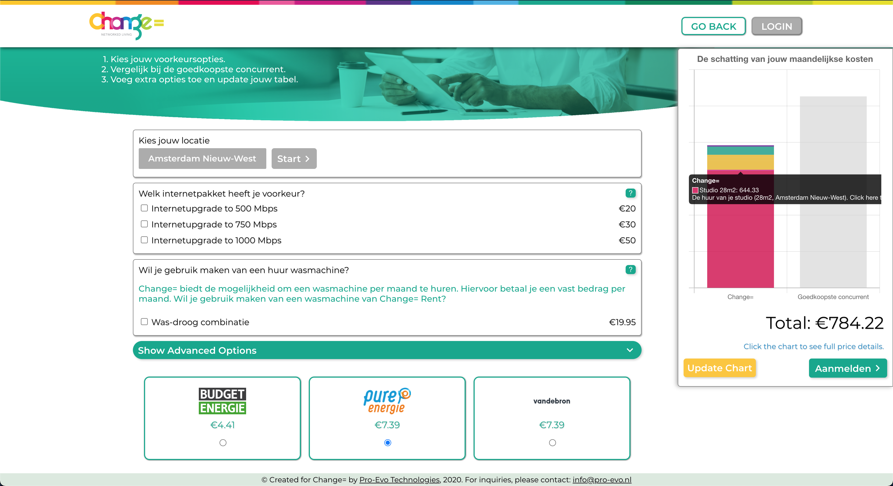
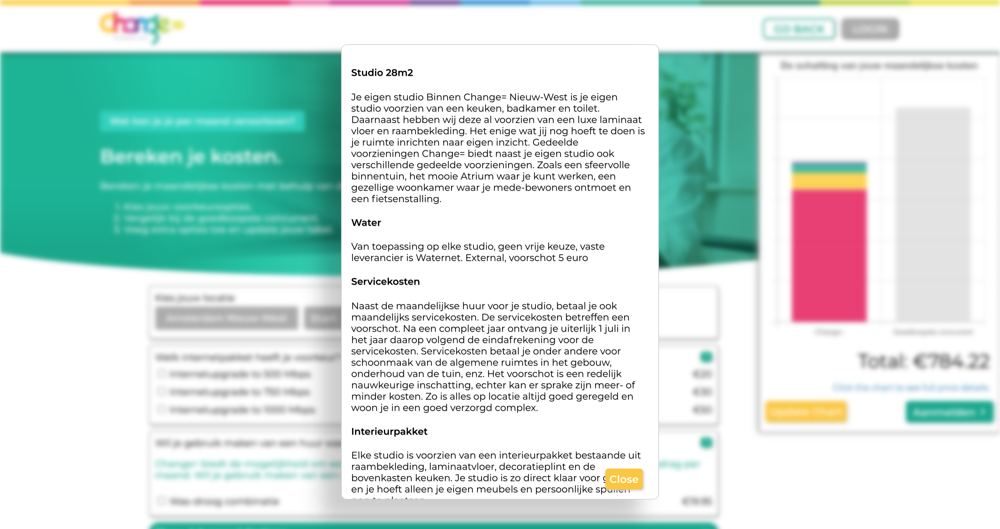

# Cost Calculator

A price-comparison widget and marketing tool for apartment complexes in Amsterdam.

We at Pro-Evo Technologies wanted to satisfy a market need for marketing tools while also providing a level of clarity and transparency you don't often find in marketing materials. Clients of ours have had to put up with complaints from tenants misunderstanding base prices, wanting to know where their monthly costs are used, or "hidden" costs they couldn't decipher from the housing agreement.

Enter [cost-calculator.nl](https://cost-calculator.nl), a simple one-pager for management companies to explain everything they need to explain about costs leveraged on tenants, while also providing a reliable alternative price for close competitors.

### Features

* Dynamic category blocks with various pricing tiers.
* Support for multiple locations.
* Chart displaying a breakdown of user's running monthly costs.
* Latest energy prices from third party suppliers.
* Options for both drop-down simple explanations and in-depth explanations on a modal.
* Both desktop- and mobile-ready.

### Made Using

       

